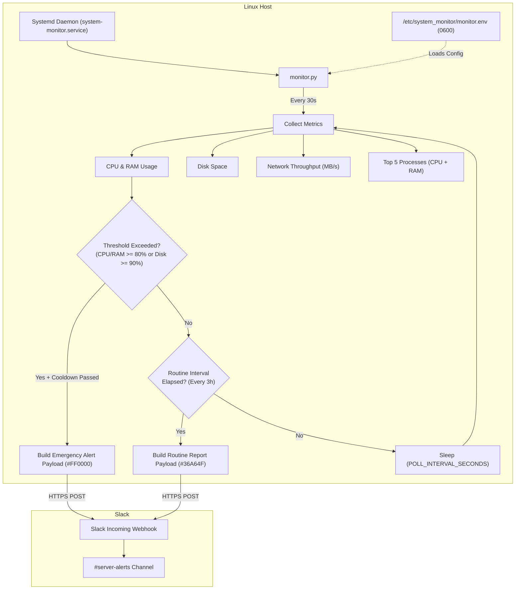

# 🖥️ server-monitor-slack-alerts

> A lightweight, zero-maintenance Linux daemon that continuously monitors server health (CPU, RAM, Disk, Network bandwidth, and Top Processes) and delivers formatted alerts to Slack. Built for DevOps engineers, sysadmins, and bug bounty automation servers running 24/7 workloads.

[](https://www.python.org/)
[](https://www.kernel.org/)
[](https://systemd.io/)
[](https://api.slack.com/messaging/webhooks)
[](LICENSE)

---

## ⚡ Quick Start: 1-Line Installation

Set up and start the monitoring daemon on any Linux server with a single terminal command:

### Option A — Instant setup with Webhook parameter (Recommended)

Pass your Slack webhook URL directly as a parameter:

```bash
curl -sSL https://raw.githubusercontent.com/axosecurity/server-monitor-slack-alerts/master/install.sh | sudo bash -s -- "https://hooks.slack.com/services/YOUR/SLACK/WEBHOOK_URL"
```

### Option B — Interactive setup (Prompts for Webhook)

Run the installer and it will prompt you interactively:

```bash
curl -sSL https://raw.githubusercontent.com/axosecurity/server-monitor-slack-alerts/master/install.sh | sudo bash
```

```text
🔔 No Slack Webhook URL provided as an argument.
   Alerts and status reports will be sent to your Slack channel.
   (Need a webhook? Create one at: https://api.slack.com/apps)

👉 Please enter your Slack Webhook URL: https://hooks.slack.com/services/YOUR/SLACK/WEBHOOK_URL
```

> [!TIP]
> The installer automatically validates your webhook, sends an immediate verification test message to Slack, registers the `system-monitor` systemd service, and enables auto-start on boot.

---

## 📋 Table of Contents

- [Overview](#-overview)
- [Key Features](#-key-features)
- [Architecture & Mechanics](#-architecture--mechanics)
- [Slack Notification Previews](#-slack-notification-previews)
- [Installation Methods](#-installation-methods)
  - [1-Line Remote Installer](#1-one-line-remote-curl-installer)
  - [Manual Git Installation](#2-manual-git-clone-installation)
- [Configuration Reference](#-configuration-reference)
- [Testing & Verification](#-testing--verification)
- [Service Management](#-service-management)
- [How to Get a Slack Webhook URL](#-how-to-get-a-slack-webhook-url)
- [Uninstallation](#-uninstallation)
- [Troubleshooting & FAQ](#-troubleshooting--faq)
- [Contributing](#-contributing)
- [License](#-license)

---

## 🔍 Overview

When running cloud servers, VPS instances, or automation pipelines (e.g. bug bounty scans, web scrapers, microservices), servers can suffer from memory leaks, runaway CPU processes, or full disks without warning.

**server-monitor-slack-alerts** runs in the background as a low-overhead systemd daemon. It samples system performance and reports back to your Slack workspace:

| Message Type | Trigger Condition | Content Included |
|---|---|---|
| **📊 Routine Status Report** | Every `NORMAL_INTERVAL_HOURS` (Default: 3h) | CPU %, RAM %, Disk %, Network speeds, Top 5 processes |
| **🚨 Emergency Alert** | CPU or RAM > `ALERT_THRESHOLD_PERCENT` (Default: 80%) or Disk > 90% | Immediate high-priority notification with offending processes |
| **✅ Verification Test** | Triggered via `python3 monitor.py --test` or during install | Verifies connectivity and delivers instant Slack confirmation |

---

## ✨ Key Features

- 🚀 **1-Line Zero-Friction Install**: One command handles dependencies, config, systemd service, and test alert.
- 💬 **Rich Slack Formatting**: Color-coded attachments (Green for routine, Red for emergency, Purple for test).
- 📈 **Process Level Visibility**: Automatically aggregates and ranks top processes by combined CPU + memory score.
- 📡 **Network Bandwidth Tracking**: Calculates live upload and download throughput (MB/s).
- 🔕 **Smart Alert Cooldown**: Built-in 5-minute cooldown stops alert spamming during sustained resource spikes.
- 🛡️ **Resource Capped**: Hard limits via systemd (`CPUQuota=5%`, `MemoryMax=64M`) ensure the monitor never slows down your production workloads.
- 🔒 **Secure Secrets Isolation**: Webhook URL and configuration are stored in `/etc/system_monitor/monitor.env` with `0600` permissions (readable only by root).
- 🔄 **Crash & Reboot Resilient**: Configured with `Restart=always` and `WantedBy=multi-user.target`.
- 📦 **Multi-Distro Support**: Automatically detects `apt`, `dnf`, `yum`, or `pacman`, handling Python PEP 668 environments cleanly.

---

## ⚙️ Architecture & Mechanics



---

## 💬 Slack Notification Previews

### 1. Routine Report (Green)
```text
📊 Routine Status Report — prod-scan-01
All systems operating normally
Time: 2026-10-08 12:00:00

System Metrics
> 🖥️ CPU Usage:     14.2%
> 🐏 RAM Usage:     38.5%  (3.08 GB / 8.00 GB)
> 💾 Disk Usage:    42.1%  (33.68 GB / 80.00 GB)
> 📡 Network:       ↑ 0.125 MB/s  ↓ 1.450 MB/s

Top 5 Processes (by CPU + RAM)
  1. `nuclei` (PID 4821) — CPU: 22.1%  RAM: 6.4%
  2. `subfinder` (PID 4830) — CPU: 12.3%  RAM: 3.1%
  3. `dockerd` (PID 1024) — CPU: 3.5%  RAM: 4.8%
  4. `python3` (PID 2801) — CPU: 2.1%  RAM: 2.9%
  5. `systemd-journald` (PID 412) — CPU: 0.8%  RAM: 1.2%
```

### 2. Emergency Alert (Red)
```text
🚨 EMERGENCY ALERT — prod-scan-01
⚠️ CPU at 94.5% & RAM at 88.2% (threshold: 80.0%)
Time: 2026-10-08 14:15:22

System Metrics
> 🖥️ CPU Usage:     94.5%
> 🐏 RAM Usage:     88.2%  (7.05 GB / 8.00 GB)
> 💾 Disk Usage:    45.0%  (36.00 GB / 80.00 GB)
> 📡 Network:       ↑ 12.450 MB/s  ↓ 45.210 MB/s

Top 5 Processes (by CPU + RAM)
  1. `heavy_worker` (PID 8912) — CPU: 82.0%  RAM: 45.2%
  2. `postgres` (PID 1204) — CPU: 10.5%  RAM: 24.1%
  3. `node` (PID 3302) — CPU: 4.1%  RAM: 11.2%
  4. `python3` (PID 2801) — CPU: 1.2%  RAM: 2.4%
  5. `system-monitor` (PID 512) — CPU: 0.2%  RAM: 0.3%
```

---

## 🚀 Installation Methods

### 1. One-Line Remote (curl) Installer

#### With Webhook as Parameter:
```bash
curl -sSL https://raw.githubusercontent.com/axosecurity/server-monitor-slack-alerts/master/install.sh | sudo bash -s -- "https://hooks.slack.com/services/YOUR/SLACK/WEBHOOK_URL"
```

#### Interactive Prompt:
```bash
curl -sSL https://raw.githubusercontent.com/axosecurity/server-monitor-slack-alerts/master/install.sh | sudo bash
```

---

### 2. Manual Git Clone Installation

If you prefer to inspect the source code locally before installing:

```bash
# Clone the repository
git clone https://github.com/axosecurity/server-monitor-slack-alerts.git
cd server-monitor-slack-alerts

# Run installer with webhook parameter
sudo bash install.sh --webhook "https://hooks.slack.com/services/YOUR/SLACK/WEBHOOK_URL"

# Or run interactively
sudo bash install.sh
```

---

## 🔧 Configuration Reference

All settings are stored in `/etc/system_monitor/monitor.env`. Edit this file at any time with root privileges:

```bash
sudo nano /etc/system_monitor/monitor.env
```

```ini
# /etc/system_monitor/monitor.env

# [Required] Slack incoming webhook URL
SLACK_WEBHOOK_URL="https://hooks.slack.com/services/YOUR/SLACK/WEBHOOK_URL"

# Routine status report interval in hours (Default: 3)
NORMAL_INTERVAL_HOURS=3

# CPU and RAM threshold percentage that triggers an emergency alert (Default: 80)
ALERT_THRESHOLD_PERCENT=80

# Disk usage percentage that triggers an emergency alert (Default: 90)
DISK_ALERT_THRESHOLD_PERCENT=90

# Number of top processes to include in reports (Default: 5)
TOP_PROCESS_COUNT=5

# Frequency of metric checks in seconds (Default: 30)
POLL_INTERVAL_SECONDS=30

# Minimum seconds between repeated emergency alerts (Default: 300 = 5 minutes)
ALERT_COOLDOWN_SECS=300

# Path to the daemon log file
LOG_FILE=/var/log/system_monitor.log
```

After modifying `/etc/system_monitor/monitor.env`, reload the service:

```bash
sudo systemctl restart system-monitor
```

---

## 🧪 Testing & Verification

### Test Slack Webhook Delivery
Trigger an immediate test alert to confirm that your server can communicate with Slack:

```bash
sudo python3 /opt/system_monitor/monitor.py --test
```

Expected output:
```text
============================================================
 System Monitor — Webhook Verification Test
 Host: prod-server-01
 Webhook: https://hooks.slack.com/services/... [hidden]
============================================================
[*] Collecting system metrics...
    CPU: 12.0% | RAM: 42.1% | Disk: 55.4%
[*] Dispatching verification message to Slack...
✅ SUCCESS! Test alert received by Slack.
```

### Run a Single Sampling Cycle
Sample metrics once and print them to the terminal without running the daemon loop:

```bash
sudo python3 /opt/system_monitor/monitor.py --once
```

---

## 📟 Service Management

| Action | Command |
|---|---|
| **Check service status** | `sudo systemctl status system-monitor` |
| **View live log stream** | `tail -f /var/log/system_monitor.log` |
| **View systemd journal logs** | `journalctl -u system-monitor -f` |
| **Restart daemon** | `sudo systemctl restart system-monitor` |
| **Stop daemon** | `sudo systemctl stop system-monitor` |
| **Start daemon** | `sudo systemctl start system-monitor` |
| **Disable auto-start on boot** | `sudo systemctl disable system-monitor` |
| **Re-enable auto-start** | `sudo systemctl enable system-monitor` |

---

## 🔑 How to Get a Slack Webhook URL

1. Go to the [Slack App Management Portal](https://api.slack.com/apps).
2. Click **Create New App** → Select **From scratch**.
3. Name your app (e.g. `Server Monitor`) and select your Slack workspace.
4. From the left navigation menu, select **Incoming Webhooks**.
5. Switch the **Activate Incoming Webhooks** toggle to **On**.
6. Click **Add New Webhook to Workspace** at the bottom of the page.
7. Select the target channel (e.g. `#server-alerts` or `#devops`) and click **Allow**.
8. Copy the generated **Webhook URL** and use it with the installer command!

---

## 🗑️ Uninstallation

To completely remove the daemon, configuration, and systemd units:

### Via 1-Line Command:
```bash
curl -sSL https://raw.githubusercontent.com/axosecurity/server-monitor-slack-alerts/master/install.sh | sudo bash -s -- --uninstall
```

### Or Manually:
```bash
sudo systemctl disable --now system-monitor
sudo rm -f /etc/systemd/system/system-monitor.service
sudo systemctl daemon-reload
sudo rm -rf /opt/system_monitor /etc/system_monitor
```

---

## ❓ Troubleshooting & FAQ

### Q1: Slack returned HTTP 404 or HTTP 403
> **Cause**: The Webhook URL is invalid, revoked, or formatted incorrectly.  
> **Fix**: Open `/etc/system_monitor/monitor.env` and verify the `SLACK_WEBHOOK_URL` value. Run `sudo python3 /opt/system_monitor/monitor.py --test` to confirm.

### Q2: How does the alert cooldown work?
> During sustained spikes (e.g. compiling code or running heavy batch jobs for 30 minutes), you won't be spammed with alerts every 30 seconds. The daemon enforces an `ALERT_COOLDOWN_SECS` window (default: 5 minutes) between emergency alerts.

### Q3: How do I rotate the log file?
> Set up a standard `logrotate` rule:
> ```bash
> sudo tee /etc/logrotate.d/system-monitor << 'EOF'
> /var/log/system_monitor.log {
>     weekly
>     rotate 4
>     compress
>     missingok
>     notifempty
>     create 640 root root
> }
> EOF
> ```

### Q4: Will this consume CPU or memory on my server?
> No. The daemon sleeps 30 seconds between checks, taking less than 1 second to sample metrics. Systemd also enforces a strict cgroup ceiling:
> - `CPUQuota=5%`
> - `MemoryMax=64M`

---

## 🤝 Contributing

Contributions, bug reports, and suggestions are welcome!

1. Fork the repository
2. Create a feature branch (`git checkout -b feature/discord-notifications`)
3. Commit your changes (`git commit -m 'feat: add Discord webhook compatibility'`)
4. Push to your branch (`git push origin feature/discord-notifications`)
5. Open a Pull Request

---

## 📄 License

This project is licensed under the MIT License — see the [LICENSE](LICENSE) file for details.
